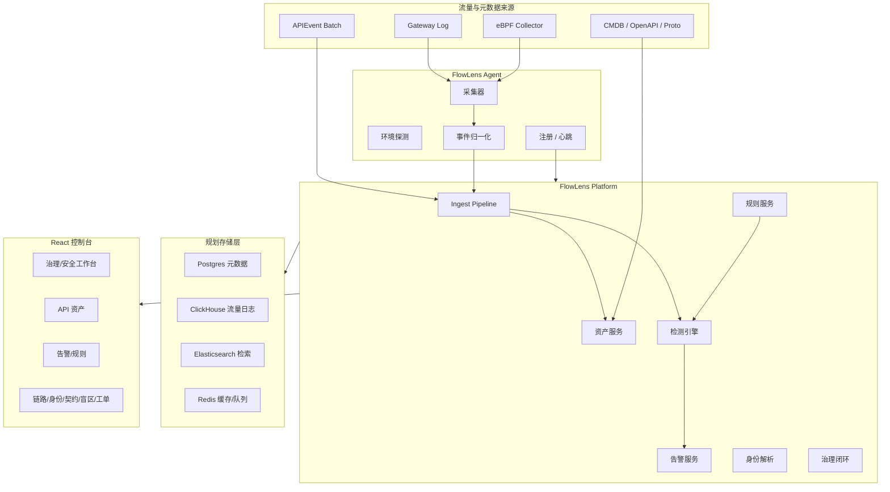
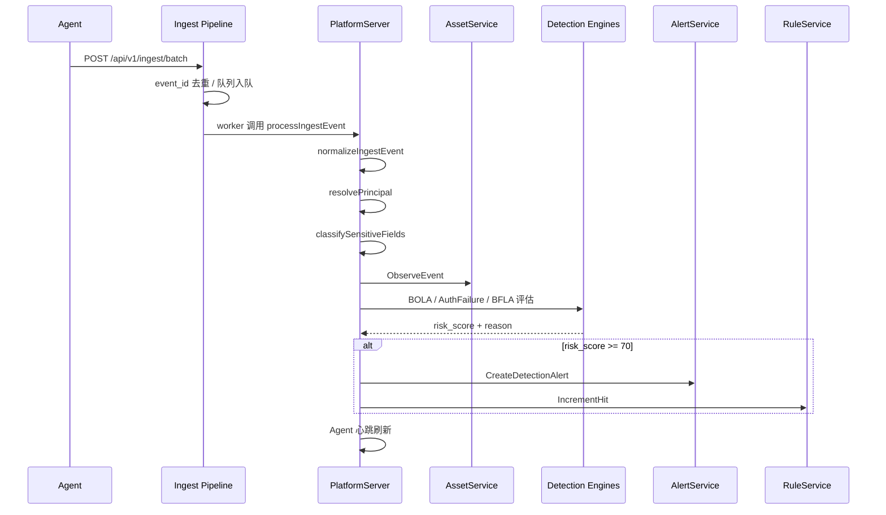

# 拂尘 FlowLens 技术说明

> 文档版本：V1.0  
> 更新日期：2026-07-08  
> 面向读者：架构师、后端工程师、Agent 工程师、平台工程师、安全研发

## 1. 技术定位

FlowLens 当前是一个以 Go 平台服务、Go Agent、React 控制台和契约文件为核心的 API 安全治理 POC。系统已经具备从采集端事件上报、平台事件接入、基础检测、资产观察、告警生成到前端治理视图展示的雏形。

当前实现要点：

- Agent：负责环境识别、采集模式选择、事件归一化、批量上报、注册和心跳。
- Platform：负责认证、Agent 管理、资产服务、告警服务、规则服务、事件接入和检测引擎编排。
- Web：负责治理驾驶舱、安全工作台、资产、告警、链路、身份、契约、覆盖率、工单、规则等控制台页面。
- Contracts：提供 OpenAPI、Proto 和 DDL，用于前后端、Agent 和存储模型对齐。
- Deploy：提供 Docker Compose 的 POC 基础设施轮廓，包括 Postgres、ClickHouse、Elasticsearch、Kafka、Redis、Platform、Web。

## 2. 总体架构

## 3. 代码结构

| 目录 | 说明 |
|------|------|
| `agent/` | FlowLens Agent，包含采集器、环境探测、归一化、健康监控、平台管理客户端 |
| `platform/` | 平台后端，包含 HTTP API、检测引擎、ingest pipeline、服务层、认证和存储接口 |
| `web/` | React + TypeScript 控制台 |
| `contracts/` | OpenAPI、Proto、DDL 合同 |
| `shared/` | Agent 与平台共享的 APIEvent 数据结构 |
| `deploy/` | Docker Compose 和部署相关配置 |
| `docs/` | 产品、技术、规划和分析文档 |
| `pkg/` | 通用日志、版本等基础包 |

## 4. 数据模型：APIEvent

核心事件结构位于 `shared/event.go`。APIEvent 将流量拆成网络层、应用层、内容层和元数据层：

| 层级 | 字段示例 | 用途 |
|------|----------|------|
| NetworkLayer | `src_ip`、`dst_ip`、`src_port`、`dst_port`、`protocol` | 来源、网络区域、攻击溯源 |
| ApplicationLayer | `method`、`path_raw`、`path_normalized`、`host`、`status_code`、`duration_ms`、`protocol_type` | API 资产、性能、协议类型、状态码 |
| ContentLayer | headers、query、request/response body、content type | 身份解析、敏感字段识别、Schema 分析 |
| Metadata | env、cluster、namespace、service、pod、node、labels | 业务分组、部署位置、责任归属 |

APIEvent 支持 JSON 序列化、大小估算和 Body 截断，适合在 Agent 上报前做基础保护。

## 5. Agent 设计

Agent 入口位于 `agent/cmd/main.go`。当前流程：

1. 加载配置，失败时使用默认配置。
2. 探测运行环境。
3. 根据配置或自动探测结果选择采集模式。
4. 初始化采集器。
5. 启动采集器、健康监控和事件处理协程。
6. 注册到平台。
7. 按心跳周期上报状态和指标。
8. 批量归一化并上报 APIEvent。

### 5.1 采集模式

当前代码已提供以下采集模式入口：

| 模式 | 当前状态 | 说明 |
|------|----------|------|
| Gateway Log | 已有实现入口 | 适合从网关日志低风险接入 |
| eBPF | 已有实现入口 | 面向内核级流量捕获，仍需生产化验证 |
| DPDK | 预留 | 当前返回未实现 |
| VPC Flow | 预留 | 当前返回未实现 |
| pcap | 预留 | 当前返回未实现 |

### 5.2 事件归一化

归一化逻辑位于 `agent/internal/normalizer/normalizer.go`，当前能力包括：

- 路径参数归一化：数字 ID、UUID、枚举、大时间戳等。
- 默认方法补齐：缺省为 `GET`。
- 默认协议补齐：缺省为 `REST`。
- 时间戳补齐。
- 环境默认值补齐。
- 自定义路径模式扩展。

### 5.3 平台管理客户端

管理客户端位于 `agent/internal/mgmt/client.go`，当前能力包括：

- Agent 注册：`POST /api/v1/agents/register`。
- 心跳上报：`POST /api/v1/agents/:id/heartbeat`。
- 批量事件上报：`POST /api/v1/ingest/batch`。
- 上报失败时重置注册状态。

## 6. Platform 设计

平台后端基于 Go + Gin。核心结构为 `PlatformServer`，聚合：

- `AgentService`
- `AssetService`
- `AlertService`
- `RuleService`
- `BOLAEngine`
- `AuthFailureEngine`
- `BFLAEngine`
- `IngestPipeline`

### 6.1 HTTP API

当前主要 API：

| API | 方法 | 说明 |
|-----|------|------|
| `/api/v1/auth/login` | POST | 登录并签发 JWT |
| `/api/v1/health` | GET | 健康检查 |
| `/api/v1/agents` | GET | 采集器列表 |
| `/api/v1/agents/:id` | GET | 采集器详情 |
| `/api/v1/agents/register` | POST | Agent 注册 |
| `/api/v1/agents/:id/heartbeat` | POST | Agent 心跳 |
| `/api/v1/assets` | GET | API 资产列表 |
| `/api/v1/assets/:id` | GET | API 资产详情 |
| `/api/v1/assets/:id/claim` | POST | API 资产认领 |
| `/api/v1/alerts` | GET | 告警列表 |
| `/api/v1/alerts/:id` | GET | 告警详情 |
| `/api/v1/alerts/:id/:action` | POST | 告警处置动作 |
| `/api/v1/ingest/event` | POST | 单条 APIEvent 接入 |
| `/api/v1/ingest/batch` | POST | 批量 APIEvent 接入 |
| `/api/v1/ingest/metrics` | GET | 接入管道指标 |
| `/api/v1/detect/access` | POST | 直接提交访问行为进行检测 |
| `/api/v1/rules` | GET | 规则列表 |
| `/api/v1/rules/categories` | GET | 规则分类 |
| `/api/v1/rules/:id` | GET/PUT | 规则详情与更新 |
| `/api/v1/audit-logs` | GET | 审计日志 |

### 6.2 Ingest Pipeline

`platform/internal/ingest/pipeline.go` 实现了基础事件管道：

- 支持队列大小配置，默认兜底为 10000，当前平台初始化为 20000。
- 支持事件 ID 去重，去重窗口清理周期为 5 分钟，保留 30 分钟。
- 支持批量提交。
- 支持 worker 并发处理。
- 输出 accepted、dropped、duplicates、processed、queue_depth、queue_size、last_event_at 指标。
- 单批最大 5000 条事件，超出返回 413。

### 6.3 事件处理流程

平台处理 APIEvent 的核心流程：

### 6.4 身份解析

当前平台端 `resolvePrincipal` 采用分层证据优先级：

1. 用户类 header：`x-user-id`、`x-account-id`、`x-authenticated-user`。
2. Partner 类 header：`x-api-key`、`x-client-id`、`x-app-id`。
3. 服务类 header：`x-service-name`、`x-caller-service`。
4. 查询参数：`user_id`、`account_id`、`uid`。
5. 来源 IP。
6. unknown。

输出包括 principal ID、类型、角色、置信度和证据来源。

### 6.5 敏感字段识别

当前 `classifySensitiveFields` 从 query、request headers、response body 中识别敏感字段线索，关键标记包括：

- phone / mobile
- id_card
- card_number / card
- token
- password / secret
- address
- email

当敏感字段与导出接口等风险上下文叠加时，平台会提高风险评分并生成数据风险告警。

### 6.6 检测引擎

当前检测引擎包括：

| 引擎 | 文件 | 当前用途 |
|------|------|----------|
| BOLAEngine | `platform/internal/engine/bola.go` | 识别对象遍历、对象级越权风险 |
| AuthFailureEngine | `platform/internal/engine/auth_failure.go` | 识别单 IP 多账号认证失败、撞库行为 |
| BFLAEngine | `platform/internal/engine/bfla.go` | 识别低权限主体访问管理端点或高权限功能 |

平台取各引擎评分中的最高值作为当前事件风险评分。当风险评分大于等于 70 时生成告警。

## 7. Web 控制台

前端位于 `web/`，主要技术栈：

- React 18
- TypeScript
- Vite
- Ant Design / Arco Design
- ECharts

当前页面包括：

| 页面 | 说明 |
|------|------|
| `GovernanceDashboard` | 管理层治理驾驶舱 |
| `Dashboard` | 安全工作台 |
| `Assets` / `AssetDetail` | API 资产列表与详情 |
| `Alerts` / `AlertDetail` | 告警列表与详情 |
| `FlowMap` | 调用链路与业务流程偏差 |
| `ContractCenter` | 契约一致性差异 |
| `IdentityCenter` | 身份与调用方识别 |
| `DataGovernance` | 敏感数据治理 |
| `CoverageCenter` | 覆盖率与盲区 |
| `Agents` / `AgentDetail` | 采集器管理 |
| `WorkOrderCenter` | 处置闭环 |
| `Rules` | 检测策略 |
| `AIGovernance` | AI 应用治理预留 |
| `RiskOps` | 业务风控 |
| `Settings` | 系统设置 |

前端服务层 `web/src/services/api.ts` 对真实 API 失败提供 mock fallback，使控制台在后端未启动时仍可演示。

## 8. 部署架构

`deploy/docker-compose.yaml` 当前定义了 POC 环境：

| 服务 | 作用 |
|------|------|
| Postgres | 元数据存储 |
| ClickHouse | 流量日志和大规模时序分析规划存储 |
| Elasticsearch | 威胁检索和证据检索规划存储 |
| Kafka / Zookeeper | 事件流式管道规划组件 |
| Redis | 缓存和队列规划组件 |
| Platform | Go 平台后端 |
| Web | 前端控制台，Nginx 托管 |

当前代码平台仍以内存服务为主，Compose 中基础设施代表 POC 到 MVP 的目标部署轮廓。

## 9. 安全与权限

当前后端具备：

- JWT 登录。
- RBAC 中间件。
- 审计中间件。
- Demo 模式下可关闭鉴权。
- 默认内存用户：`admin / admin123`，角色为 `super_admin`。

生产化建议：

- 移除或强制变更默认密码。
- 接入企业 IAM / SSO。
- JWT Secret 外置到安全配置。
- 所有 Agent 与平台通信启用 mTLS 或签名。
- 对 request/response body 做采样、脱敏、加密和访问审计。
- 将规则更新、告警处置、资产认领纳入审计日志。

## 10. 当前技术边界

当前项目已经具备较完整的 POC 结构，但仍需注意边界：

- 存储服务接口存在，但多数业务数据仍由内存服务和 mock 数据驱动。
- eBPF、DPDK、VPC Flow、pcap 等采集模式尚未全部生产可用。
- Kafka、ClickHouse、Elasticsearch 已出现在部署规划中，但平台代码尚未深度集成。
- AI 应用治理是预留页面和规划能力。
- 数据分类、Schema 差异、调用链路还原当前主要是演示逻辑，后续需接入真实算法和元数据源。
- 性能压测、回放测试、端到端集成测试仍需补齐。

## 11. 工程化建议

### 11.1 短期

- 为 APIEvent 增加样例回放脚本。
- 为 ingest pipeline 增加单元测试和压力测试。
- 将规则、资产、告警服务从内存迁移到 Store 接口。
- 明确 Agent 配置文件样例。
- 为 Docker Compose 增加一键启动文档。

### 11.2 中期

- 接入 Kafka 作为事件缓冲层。
- 将原始流量摘要写入 ClickHouse。
- 将告警证据和检索字段写入 Elasticsearch。
- 接入 Postgres 管理资产、规则、工单、审计等元数据。
- 完成 Agent 与平台之间的鉴权、签名和 mTLS。

### 11.3 长期

- 建立行为基线模型。
- 接入企业 CMDB、IAM、网关、OpenAPI 仓库、SOAR、工单系统。
- 支持多租户隔离。
- 支持自定义检测规则 DSL。
- 将 AI 应用治理纳入统一 API 和数据流治理模型。
